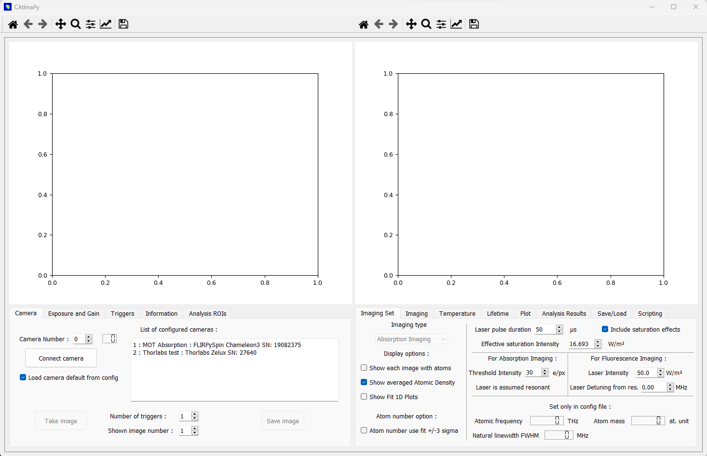

.. _Description-and-Use:

Description and Use
*******************

Launching CAtImaPy
==================

CAtImaPy can be launched by Python or IPython. If you have Python installed, 
you can normally launch CAtImaPy by double-clicking on the *CAtImaPy.py* file in *CAtImaPy* folder.
You can also run it via a python coding software like `Spyder <https://www.spyder-ide.org/>`_.

You should then see the GUI opening like this :

GUI organization
================

The GUI features two graphs and two set of tabs. 
The left side is mainly dedicated to the camera and the representation of two-dimensional data (camera images and measured atomic densities).
The right side mostly provides controls and results of imaging measurements. 
The names of parameters and buttons are quite straightforward but more details are given below.

Preparation and operation 
=========================

The general procedure to prepare and launch a standard imaging measurement is the following sequence:  

#. Connect the camera in the :ref:`Tab-Camera`.

#. Check/change the parameters of the camera in the left tabs.

#. Check/change the ROIs used for analysis in :ref:`Tab-Analysis-ROIs`.

#. Check/change the parameters of the measurement in :ref:`Tab-Imaging-Set` and :ref:`Tab-Imaging`. 

#. Launch an imaging measurement by clicking the *Start Measurement* button in :ref:`Tab-Imaging`. 

#. Start the experiment control with the matching number of experimental sequences.  

Then, CAtImaPy will: 

#. Wait for triggers to arrive on the camera and acquire the images, and optionally save them.

#. Calculate the measured atomic density and integrate the numbers of atoms in the defined ROIs.

#. Fit Gaussian functions on the atomic density integrated along each axis in the defined ROIs.

#. Repeat the operations above for the given number of *Averages*.

#. Fit Gaussians on the average atomic density, giving the cloud center and radii (standard deviations).

#. Update right graph and GUI values with the results of the fits.

#. Repeat the operations above for the given number of *Scans*, and optionally save chosen results.

Afterwards, the user can interact with the graphs and the tabs again. 
In particular, the :ref:`Tab-plot` allows one to change the results shown on the left graph 
and the :ref:`Tab-Save-Load` allows one to save selected results to the hard disk. 

Below, we give details on the settings in each one of the tabs of the GUI.

Interaction with the camera (left tabs)
=======================================

.. _Tab-Camera:

Tab Camera
----------

The numbers at the beginning of each line in the *List of configured cameras* allows you to choose the value of the *Camera Number*. 
If you do not find your camera, you need to set it by following instructions in :ref:`Configuring-camera-and-acquisition-parameters`.

After clicking on button *Connect camera*, if connection succeed, the indicator next to *Camera Number* switch to the selected camera number. 
This acquisition buttons (as *Take image* for example) are enabled and the camera defaults parameters are loaded.

If the trigger is set to *software* in the :ref:`Tab-Triggers`, 
you should get an image from the camera simply by clicking on the button *Take image*. 
If the trigger is set to *external*, after clicking on the button *Take image*, 
you need to send to the camera the number of hardware rising edge signal indicated as *Number of triggers* to proceed properly to the acquisition. 
Within the series acquired images, you can select the number of the image that will be shown on the left graph with the corresponding parameter.

The *Save image* button saves a screenshot of the left graph in PNG file with a timestamp in the name inside the saving directory, selected in :ref:`Tab-Triggers`.

Tab Exposure and Gain
---------------------

Here you can see and set the exposition duration, and if available the hardware gain. 
Any value change for these parameters need to be validated with the *Set Exposure and Gain* button 
and values will be updated with the ones actually implemented. 

Two automatic procedures allow one to adjust the exposure (and the gain if allowed and necessary) 
such that either the average or the maximum value of the image reach a given level within a given range. 
The values are expressed as percentage of the maximum value possible for one pixel, related to the sensor bit depth. 
The mean and maximum value of the image shown are given in percentage and in absolute values.

.. _Tab-Triggers:

Tab Triggers
------------

The trigger can be selected as two options: 

* *external*: for any acquisition of an image
  the camera waits for an external trigger with a rising edge on its hardware digital input. 
  If no trigger occurs within the number of seconds indicated as *Timeout for external trigger*,  
  the current sequence of acquisition is aborted.
  This is the normal mode of operation for synchronization with experimental sequence.
  
* *software*: the camera exposure is triggered directly and immediately by CAtImaPy.
  This mode is only useful for tests of the camera and alignment of laser beams on the camera.
  
There are two options to acquire additional images (and thus to expect the corresponding triggers) 
to clean the sensor of previously accumulated charges and/or to acquire an image of the background light in order to remove it.

Tab Information
---------------

This tab simply shows information on camera and related imaging parameters 
that are set via *Cameras\Config.py* or obtained directly from camera.

.. _Tab-Analysis-ROIs:

Tab Analysis ROIs
-----------------

Here, you can manage regions of interest (ROIs) used for the analysis of the measured atomic densities. 
Typically, you will use an ROI per atomic cloud and/or per atomic cloud position in your experiment. 

Each line of the table defines one ROI associated to a camera number, with a name to remember what it is intended for,
and with its definition (center positions and sizes) in µm. 
Any change has to be validated by pressing the *Set* button. 

All the analysis ROIs of a camera are used to perform the analysis during a imaging scan. 
As this analysis use curve fitting, using too many ROIs may slow down CAtImaPy 
such that it cannot follow the pace of camera acquisitions imposed by the experiment control hardware. 
If this happens, remove unnecessary ROIs or reduce experimental cycling rate.

Among the defined ROIs for one camera, three of them (black, red and green) can be selected 
by their numbers (corresponding to the line number of the table).
The *Draw* option represents the enabled ones on the left graphs on top of the image or the atomic density.
These ROIs will be selectable in :ref:`Tab-Plot` for showing analysis results in the right graph. 
The black ROI is the one to which correspond the calculated numbers of analysis results 
in :ref:`Tab-Imaging`, :ref:`Tab-Temperature` and :ref:`Tab-Lifetime`.

Imaging parameters and results (right tabs)
===========================================

.. _Tab-Imaging-Set:

Tab Imaging Set
---------------

CAtImaPy allows two type of imaging for clouds of cold atoms: 

* **Absorption imaging** relies on measuring the absorption of a laser beam by the atomic cloud at resonance frequency. 
  In this mode, CAtImaPy records at least two images one with atoms :math:`I\!m_{\mathrm{at}}` 
  and one reference without atoms :math:`I\!m_{\mathrm{ref}}` (typically taken few tenths millisecond later when the cloud has fallen).
  If enabled, the background image is subtracted to the previous ones. 
  From the images :math:`I\!m` in electrons per pixel, 
  we convert to photon flux :math:`\phi = I\!m / ( A_{\mathrm{px}} * \eta_{\mathrm{QE}} * \tau_{\mathrm{laser}})` 
  in the object plane by using the area of a pixel :math:`A_{\mathrm{px}} = w_{\mathrm{px}} * h_{\mathrm{px}}`, 
  the quantum efficiency :math:`\eta_{\mathrm{QE}}` of the sensor at the transition wavelength
  and the duration of the laser pulse :math:`\tau_{\mathrm{laser}}`.
  
  The atomic density :math:`n` integrated along the optical axis of imaging :math:`z` is [Reinaudi2007]_ [Steck2001]_ :
  
  .. math::  n_{z} = \int{ n \, \mathrm{d}z} = - \frac{I_{\mathrm{sat}}}{h f \gamma} \ln \frac{\phi_{\mathrm{at}}}{\phi_{\mathrm{ref}}}  + \frac{\phi_{\mathrm{ref}} - \phi_{\mathrm{at}}}{\gamma}
     :label: abs
  
  where :math:`h` is the Planck constant, :math:`f` is the transition frequency, 
  :math:`\gamma`  is the coherence (dipole) decay rate of the excited state 
  and :math:`I_{\mathrm{sat}}` the effective saturation intensity, accounting for the actual dipole of the transition.

* **Fluorescence imaging** uses the scattering of a laser beam by the atomic cloud. 
  In this mode, CAtImaPy records at least one image with atoms :math:`I\!m_{\mathrm{at}}` 
  If enabled, the background image is subtracted to the previous one. 
  The image is also converted to the photon flux :math:`\phi_{\mathrm{at}} = I\!m_{\mathrm{at}} / ( A_{\mathrm{px}} * \eta_{\mathrm{QE}} * \tau_{\mathrm{laser}})` 
  in the object plane.
  
  Under the assumptions that the cloud has a density low enough such that multiple scattering of one photon has a low probability 
  and that the photon emission is isotropic, 
  the atomic density :math:`n` integrated along the optical axis of imaging :math:`z` is [Esslinger1992]_ [Serre1998]_ [Steck2001]_ :
  
  .. math:: n_{z} = \int{ n \, \mathrm{d}z} = \phi_{\mathrm{at}} \times \frac{2}{1 - \sqrt{1 - N\!A^{2}} } \times \frac{1  + \left(\frac{\delta}{ \gamma}\right)^{2} + \frac{I_{\mathrm{laser}}}{ I_{\mathrm{sat}}}}{\gamma \frac{I_{\mathrm{laser}}}{ I_{\mathrm{sat}}} } 
     :label: fluo
  
  where the second term uses the numerical aperture :math:`N\!A`
  to compute the inverse of the fraction of the solid angle collecting photons towards the camera, 
  and the third term is the inverse of the scattering rate of a single atom. 
  The latter depends on the intensity of the laser  :math:`I_{\mathrm{laser}}` 
  and the detuning :math:`\delta = 2 \pi ( f_{\mathrm{laser}} - f)` of its frequency :math:`f_{\mathrm{laser}}` 
  with the one of the atomic transition :math:`f`.

The tab *Imaging Set* allows you choose the type of imaging, and to control or see the variables of the aboves equations. 
Some variables (like the transition frequency :math:`f`) can only be changed in the *Config.py* file 
and thus require a restart of CAtImaPy after any change. 
Unchecking the *Include saturation effects* options allows you to see the importance of saturation in you imaging, by zeroing
either the saturated part (second term in Eq. :eq:`abs`) in absorption imaging,
or the :math:`I_{\mathrm{laser}} / I_{\mathrm{sat}}` term in the numerator of Eq. :eq:`fluo` in fluorescence imaging. 

The tab also allows you to select various options of displays. 
*Show each image with atoms* and *Show averaged Atomic Density* apply to the left graph during a measurement scan.
*Show Fit 1D Plots* generate an external window with graphs showing the fit over the data for each average and each ROI. 

The atom number option restricts the integration region, used to calculate the atom number, 
to the rectangular zone centered on the fitted maximum,
with width and height given by 6 times the corresponding fitted Gaussian standard deviation :math:`\sigma` (cloud radius). 
The feature is normally only useful when the atomic cloud moves considerably, 
within the imaging measurement, in a noisy background. 

.. _Tab-Imaging:

Tab Imaging
-----------

*Averages* and *Scans* multiplied give the number of experimental *Cycles* (sequences), 
i.e. single atomic-density measurements, expected before the end of the imaging measurement. 
The other variables (*Scan start*, ...) are only used to define the x-axis of the right graph.
The scan variable is assumed to evolve linearly from the *start* value with an increment value given by *step*.   

The *Start measurement* button begins the acquisition. 
Make sure that the camera will receive its first trigger within the timeout defined in :ref:`Tab-Triggers`.

The right side of the tab indicates results of the last fit on averaged atomic density in the selected black ROI.

.. _Tab-Temperature:

Tab Temperature
---------------

This tab allows to measure the temperature of the cloud by time-of-flight (T.O.F.) measurements, 
where the cloud is allowed to evolve freely (no trap) for a time of flight (duration) :math:`t`. 
A T.O.F. scan runs as a standard scan, except that the timings set in milliseconds 
as *T.O.F. Start* and *T.O.F. Step* need to match the ones defined in the experimental sequence. 
At the end of a T.O.F. scan, CAtImaPy fits the evolution of the cloud radii :math:`\sigma` (Gaussian standard deviation) 
to extract the temperature along each axis with the linear evolution:

.. math:: \sigma^{2} (t) = \frac{k_\mathrm{B} T}{m} t^{2} + \sigma_{0}^{2}
   :label: TOF

where :math:`k_\mathrm{B}` is the Boltzmann constant,  :math:`m` is the mass of the atom, 
and the fitted parameters are the temperature :math:`T` and the initial radius :math:`\sigma_0` of the cloud.

The resulting data and fits are plotted on the right graph, 
and the right side of the tab provides the measured atom number and the fitted temperatures for the selected black ROI.

If the number of *Scans* (not to be confused with *T.O.F. scans*) is larger than 1,
CAtImaPy performs a series of T.O.F. scans allowing you to measure the temperature as function of a experimental variable. 
Again, the evolution of the variable is assumed linear and given by *Scan Start* and *Scan Step*. 
The final state of the right graph then provides the evolution of the measured temperatures, 
with the x-axis title using the *Scan variable name* and *Unit name* fields of :ref:`Tab-Imaging`.

.. _Tab-Lifetime:

Tab Lifetime
------------

The organization of lifetime measurements are very similar to temperatures measurements discussed above. 
The only difference is that the fit is an exponential decay on the atom number :math:`N`, 
as function of waiting time in trap :math:`t`. 
The fit function is 

.. math:: N(t) = N_{0} e^{- \frac{t}{\tau}} + N_{\mathrm{offset}}
   :label: exp
   
providing the fitted parameters: the *initial atom number* :math:`N_{0}`, 
the residual offset of atom number :math:`N_{\mathrm{offset}}` and the lifetime :math:`\tau`.

.. _Tab-Plot:

Tab Plot
--------

This tab allows to control the right graph by selecting the variables and the ROIs to plot. 
Up to two different variables can be shown by using either the left and right y-axes.  
The ROIs can be selected to among the three selected black, red and green ones in :ref:`Tab-Analysis-ROIs`.
Click on *Update* after a change of plotting parameters.

For temperature and lifetime measurements, the plotting parameters adapt automatically.

.. _Tab-Analysis-Results:

Tab Analysis Results
--------------------

Clicking the *Print* button give the text output all the variables (except 2D data) of the imaging parameters and results stored 
in the ``Imaging`` object of class :class:`~CAtImaPy.Imagings.ImagingClass`.
The result is pretty similar to the saved '.txt' file using :ref:`Tab-Save-Load`,
with an additional line limit cutting large arrays. 

.. _Tab-Save-Load:

Tab Save/Load
-------------

Saving imaging results starts by setting the directory for the data in the storage,
by using the *Choose Directory* button and selecting it with the pop-up windows.
CAtImaPy then creates a filename with a pattern *Imaging<Number>*,
where the integer <Number> is set at zero if no file matches the pattern or at the next available by incrementing.
The resulting file path is indicated by the *file* field.

Pressing the *Save Imaging results*, take the information over the measurement contained in the ``Imaging`` object, 
send it to a python dictionary and add to it the text of the *Saving Comment* as 'Comment' key.
Then, the dictionary is stored in string and pickle formats in '.txt' and '.imo' files respectively.
The '.txt' format allows a user to quickly see the results, 
while the '.imo' file is intended for loading with CAtImaPy or other python code. 

None of the 2D-data arrays (images, atomic densities) are saved in these files. 
The only exception is the *Save last atomic density* option 
that stores the last taken averaged atomic density data in the '.imo' file.

If you want to save the images taken during the measurement,
you need to activate the *AUTO SAVE measurement* option that stores results at the end of the sequence
and then also activate the *AUTO SAVE every image* option.
The image format can be the numpy compressed format *NPZ* (1 file per cycle), 
the PNG image format (1 file per image) or the TIFF image format (1 file per cycle), 
ordered by increasing required storage.

The two *Save picture ...* options save screenshots of the left and right graphs as PNG images,
with suffixes '_Image.png' and '_AnalysisGraph.png' to the file name, respectively. 

Scripting
=========

The rightmost tab *Scripting* is a feature for advanced users who require more from the previously discussed functions. 
The main idea is to give access to customized codes to acquire or analyze data via CAtImaPy objects and GUI. 

You can write a code saved in '.py' format, a.k.a a *script*, like a method of ``mainWin`` object, the central feature of CAtImaPy.
Thus, in this script, ``self`` will be interpreted as ``mainWin`` object giving access to all CAtImaPy functions and variables. 
To write the code, you need to get to know CAtImaPy architecture. 
As good starting point, you should read the :ref:`API-documentation`, and specifically the section on :ref:`CAtImaPy-main-code`  

To execute the code, you need to first *Load script* by selecting the file. 
Then, CAtImaPy prints the path below 
and indicates the file name in the *Reload and Run* button that triggers the execution of the code. 

.. rubric:: References

.. [Reinaudi2007] G. Reinaudi, T. Lahaye, Z. Wang and D. Guéry-Odelin, 
   *Strong saturation absorption imaging of dense clouds of ultracold atoms*, Optics Letters **32**, 3143 (2007),
   DOI : `10.1364/OL.32.003143 <https://doi.org/10.1364/OL.32.003143>`_ .

.. [Steck2001] D. A. Steck, *Rubidium 87 D line data*, 
   available online at `<https://steck.us/alkalidata/>`_ , (2001).

.. [Esslinger1992] T. Esslinger, A. Hemmerich and T.W. Hänsch, 
   *Imaging an atomic beam in two dimensions*, Optics Communications **93**, 49 (1992),
   DOI : `10.1016/0030-4018(92)90127-D <https://doi.org/10.1016/0030-4018(92)90127-D>`_ .

.. [Serre1998] I. Serre, L. Pruvost and H.T. Duong, 
   *Fluorescence imaging efficiency of cold atoms in free fall*, Applied Optics **37**, 1016 (1998), 
   DOI : `10.1364/AO.37.001016 <https://doi.org/10.1364/AO.37.001016>`_ .