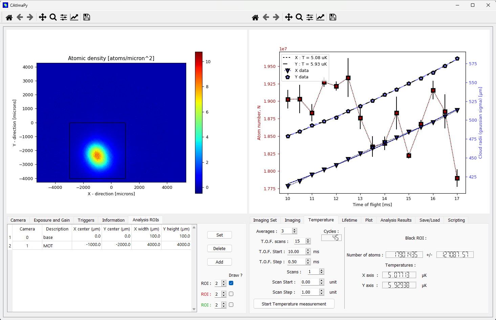

.. CAtImaPy documentation master file, created by
   sphinx-quickstart on Thu May  2 14:14:07 2024.
   You can adapt this file completely to your liking, but it should at least
   contain the root `toctree` directive.
   

CAtImaPy: Cold-Atom Imaging with a Python GUI
*********************************************

CAtImaPy provides a graphical user interface (GUI) to acquire, 
analyze and save series of imaging measurements on cold atomic clouds.

.. note::
   CAtImaPy is a free software under GNU General Public Licence version 3.
   CAtImaPy comes without any waranty, in particular on its results or its maintenance. 
   However, if you have any issues, suggestions, or feedback, 
   you can raise an issue on GitHub at `CAtImaPy's issues <https://github.com/SebastienGarciaAissa/CAtImaPy/issues>`_.
   
You can cite this software via Zenodo using the DOI :
.. image:: https://zenodo.org/badge/DOI/10.5281/zenodo.12806162.svg
  :target: https://doi.org/10.5281/zenodo.12806162

Contents
==================

.. toctree::
   :maxdepth: 2
   
   installation
   camera_drivers
   description_and_use
   api_documentation

Index
=====

* :ref:`genindex`
